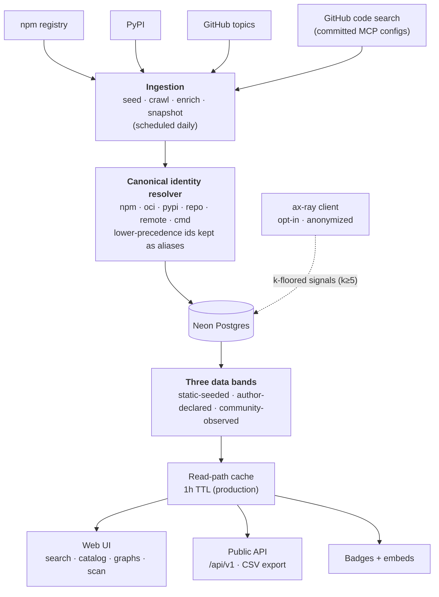

# ax-registry

**The credibility & reliability layer for MCP servers.** ax-registry measures
which Model Context Protocol servers the ecosystem *actually runs* — adoption
derived from the public repositories that wire them up — and presents it as a
fast, browsable registry with per-server pages, relationship graphs, category
leaderboards, a stack scanner, embeddable badges, and a public API.

Think "the adoption/reliability layer on top of every MCP server," not another
directory. Live at **[axregistry.com](https://axregistry.com)**.

> Trust-language rule: we say **observed**, **measured**, **listed**, **attested
> by N signals** — never *verified*, *safe*, or *trusted*. Every number links to
> how it's computed.

---

## See it in action

<p align="center">
  
  <br><sub><b>Search anything by real adoption</b> — type a server or client, results ranked by the repos that actually run it.</sub>
</p>

<table>
  <tr>
    <td width="50%" valign="top">
      
      <br><sub><b>Ecosystem insights</b> — adoption, client landscape, co-occurrence.</sub>
    </td>
    <td width="50%" valign="top">
      
      <br><sub><b>Category leaderboards</b> — what leads each space.</sub>
    </td>
  </tr>
  <tr>
    <td width="50%" valign="top">
      
      <br><sub><b>Per-server graph</b> — co-occurring servers, the repos that wire it, adoption trend.</sub>
    </td>
    <td width="50%" valign="top">
      
      <br><sub><b>Stack scanner</b> — every MCP server a repo wires up, across six kinds.</sub>
    </td>
  </tr>
</table>

<!-- Media assets live in docs/media/ — see docs/media/README.md for the shot list
     and recording guide. Add the files before pushing so these don't render broken. -->

## What it does

- **Search** every server and client by real adoption (typeahead across the catalog).
- **Per-server pages** — static facts, an ego **relationship graph** (co-occurring
  servers + the repos that wire them), client breakdown, adoption trend, badges.
- **Category leaderboards** — the most-adopted servers per space (databases,
  browser automation, search, …), derived from each server's metadata.
- **Reverse lookups** — every repo using a server, and the full MCP stack of any
  GitHub org, with CSV export.
- **Stack scanner** — point at a public repo or paste a config; get a report on
  every MCP server it wires up, across all six identity kinds.
- **Signed-in extras** — watch servers, save scans, claim servers you maintain.
- **Public API + embeds** — JSON endpoints, a live adoption badge, and an
  embeddable card. See [`/developers`](https://axregistry.com/developers).

## How it works

- **One identity across six kinds.** Servers ship as npm/PyPI packages, OCI
  images, source repos, remote endpoints, or local commands. Each is resolved to
  one canonical id (`npm:` / `oci:` / `pypi:` / `repo:` / `remote:` / `cmd:`) with
  lower-precedence ids kept as aliases, so records merge instead of duplicating.
- **Three data bands, never blended.** *Static-seeded* (public sources),
  *author-declared* (claimed pages), and *community-observed* (opt-in, anonymized
  ax-ray signal — k-anonymity floored, Phase 2).
- **Demand-side adoption.** We follow public configs that commit a server, so the
  ranking reflects what people actually run — re-derivable by anyone via code search.
- **Privacy by construction.** We never store a secret, env value, file path,
  machine id, or user identity. The `cmd:` id is a hash of normalized argv + env
  *key names* only. Repos that opt out of listing are counted, never named.

## Architecture



- **Ingestion** discovers servers (npm/PyPI/GitHub topics) and follows public
  configs to record consumer→server **usage edges**. It's idempotent and the
  crawl is resumable.
- The **identity resolver** collapses every form of a server into one canonical
  row, so a package found via npm and via a config become the same record.
- **Reads** route through a data cache (production) so a burst of page views
  hits Postgres at most once per TTL — protecting the Neon compute budget.
- The **community band** (Phase 2) is fed only by the opt-in **ax-ray** client
  (published on npm) and is exposed only above the k-anonymity floor.

## Tech stack

Next.js 16 (App Router) · React 19 · TypeScript · Tailwind v4 · Drizzle ORM ·
Neon serverless Postgres · Auth.js v5 (GitHub/Google/GitLab, JWT sessions).

## Quick start

Prerequisites: **Node 20+** and a **Postgres** database (a free [Neon](https://neon.tech)
project is the intended target).

```bash
git clone https://github.com/hn-research/axregistry.git
cd axregistry
npm install

cp .env.example .env.local      # for the app
cp .env.example .env            # for drizzle-kit + the ingest scripts
# edit both: set DATABASE_URL (keep it identical in the two files)

npm run db:push                 # apply the schema to your database
npm run dev                     # http://localhost:3000
```

The app runs fully anonymous out of the box. To enable login, set `AUTH_SECRET`
plus a provider's client id/secret (see `.env.example`).

## Populating data

```bash
npm run seed       # discover servers: npm + PyPI + GitHub topics
npm run crawl      # find public configs → usage edges (needs GITHUB_TOKEN)
npm run enrich     # backfill facts for thin server stubs
npm run snapshot   # record today's adoption for the trend lines
# or run all four:
npm run ingest
```

`CRAWL_MAX_PAGES=10 npm run crawl` goes deep (GitHub caps each query at 1000).
The crawl is resumable — re-run to continue from its checkpoint. A daily
[GitHub Actions workflow](.github/workflows/ingest.yml) runs the whole pipeline
on a schedule.

## Deployment

Vercel + Neon. See **[DEPLOY.md](DEPLOY.md)** for the env-var and OAuth checklist.

## Open source & the data model

The **application code is MIT-licensed** — fork it, run it, build on it.

The **aggregated community-observed dataset** (ax-ray signals and the reliability
/ security / permission intelligence derived from them) is **not** open: it's
served only through the hosted service and API, and never published raw.
Public-signal adoption data is re-derivable by anyone from public package
registries and public GitHub configs. (A fork gets the code, not the network.)

## Contributing

Contributions welcome — start with **[CONTRIBUTING.md](CONTRIBUTING.md)**. It
covers setup, the checks to run, and the project's non-negotiable **trust-language
and privacy invariants**. Please also read the
[Code of Conduct](CODE_OF_CONDUCT.md). Security issues: see [SECURITY.md](SECURITY.md).

## License

[MIT](LICENSE) for the application code. See the license file for the data-model
caveat above.
